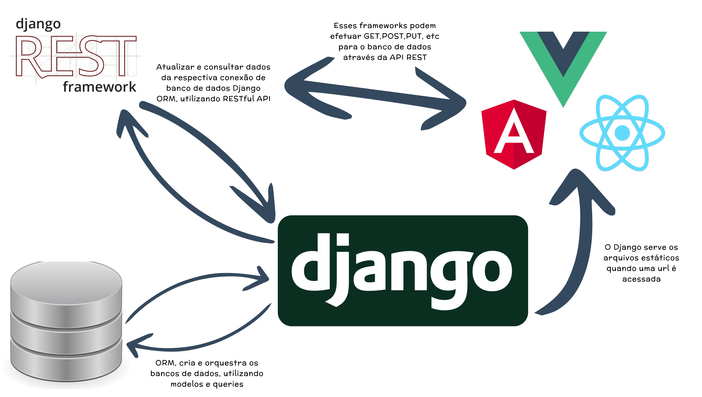

# Pilares do Desenvolvimento com Django 🏛️

<p align="center">
    
</p>


# Ideia Central Django Rest Framework

 DRF é uma biblioteca criada para adicionar funcionalidades RESTful ao Django. Ele facilita a construção de APIs (Application Programming Interfaces) que podem ser consumidas por clientes como aplicativos móveis ou aplicações frontend em JavaScript, como   .

 # Em Resumo:

**Django**: Usado para construir aplicações web completas com interfaces de usuário dinâmicas.

**Django REST Framework**: Usado para adicionar funcionalidades de API RESTful ao Django, facilitando a criação de APIs que permitem a comunicação entre servidores e clientes (como aplicativos móveis ou aplicações frontend em frameworks JavaScript).

# Instalação do Django REST Framework 🚀

Para instalar o Django REST Framework, você pode utilizar o gerenciador de pacotes Python pip. Abaixo está o comando de instalação:

```bash
pip install djangorestframework
```

Certifique-se de estar em um ambiente virtual Python adequado ao seu projeto antes de executar este comando.
